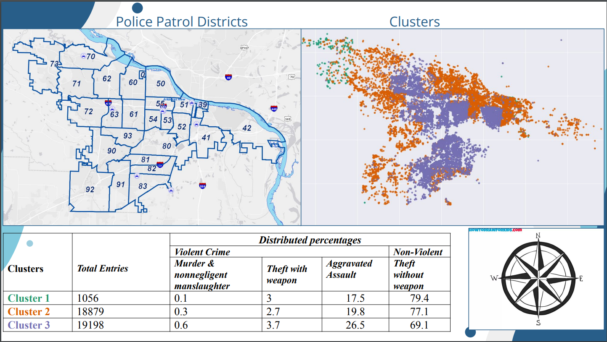

# Crime-Rate-Prediction-and-Analysis

This is my final school project (Capstone) where I used data science and data analysis techniques to predict and label the most dangerous areas in Little Rock, Arkansas using clustering techniques

## Analysis and results

In summary, the southeast and center areas (cluster 3) are the most dangerous in the city, while the northwest (cluster 1) is the safest.
